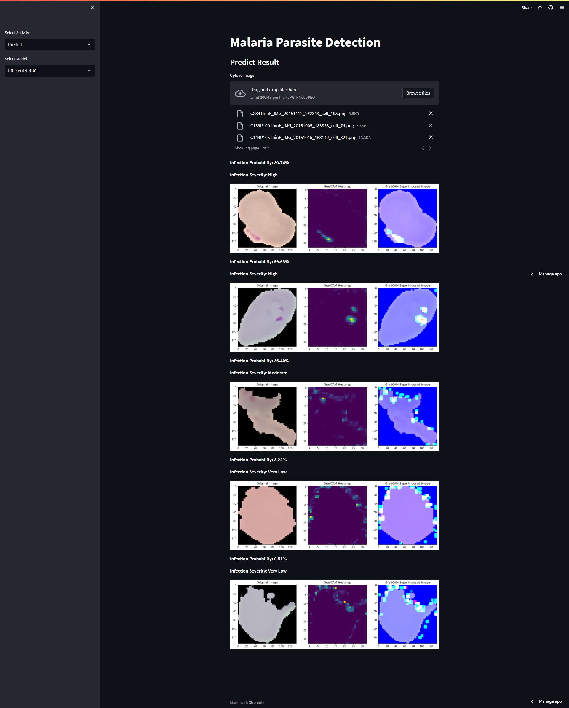
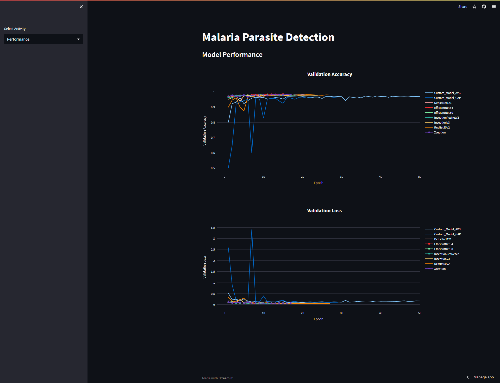

<!-- make explanation for this malaria parasite detection repo  -->

## Malaria Parasite Detection

Malaria parasite detection with the help of transfer learning, snapshot ensemble and gradient camera

### Dataset

[Thin Blood Smear Dataset](https://lhncbc.nlm.nih.gov/LHC-research/LHC-projects/image-processing/malaria-datasheet.html)

### Demo link (still in development though)

https://malariaparasitedetection.streamlit.app/

### Preview of the demo

<!-- give image  -->

